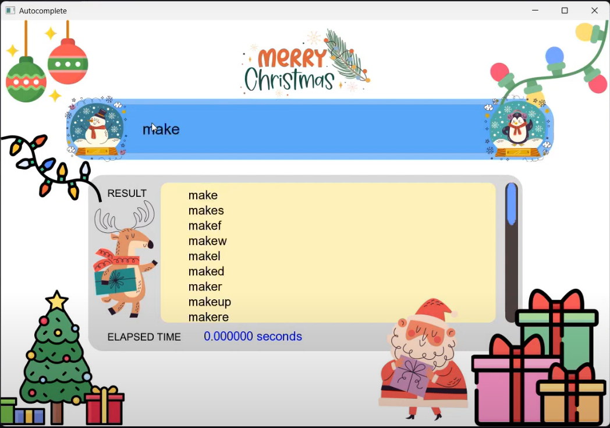
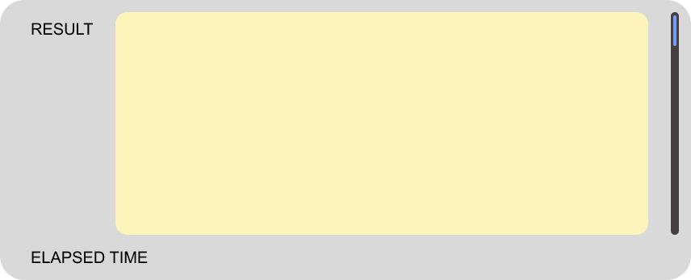
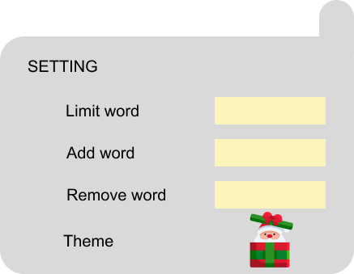

# TrieSearchBar

TrieSearchBar is an autocomplete application that uses a compressed trie data structure to provide fast and efficient search suggestions.



## Features

- Autocomplete search bar
- Scrollable result tab
- Settings tab to customize the application
- Uses SFML for rendering

## Installation

1. Clone the repository:
    ```sh
    git clone https://github.com/yourusername/TrieSearchBar.git
    cd TrieSearchBar
    ```

2. Build the project using CMake:
    ```sh
    mkdir build
    cd build
    cmake ..
    make
    ```

3. Run the application:
    ```sh
    ./TrieSearchBar
    ```

## Usage

- Start typing in the search bar to get autocomplete suggestions.
- Use the scroll bar to navigate through the suggestions.
- Access the settings tab to customize the application.

## Dependencies

- SFML 2.6.2

## Assets





## License

This project is licensed under the MIT License - see the LICENSE file for details.

## Acknowledgements

- SFML for providing the graphics library
- All contributors to the project
